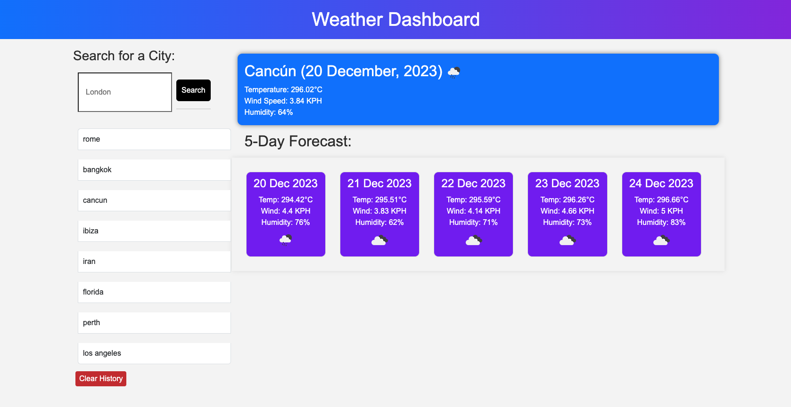

# weather-dashboard
A 5 day weather forcast to retrieve weather data for cities.

## Table of Contents

- [Full Description](#full-description)
- [Features](#features)
- [How to Use](#how-to-use)
- [Screenshot](#screenshot)

## Full Description
AS A traveler I WANT to see the weather outlook for multiple cities SO THAT I can plan a trip according. This app does just that. A 5 day weather forcast to retrieve weather data for cities. This app runs in the browser and features dynamically updated HTML and CSS powered by Javascript.
URL of deployed app:  https://feliperyder.github.io/weather-dashboard/

## Features

**Weather Dashboard with Form Inputs:**
   - Users can input a city name to access weather information.

**City Search and History:**
   - Upon searching for a city, users are presented with current and future weather conditions for that city.
   - The searched city is added to the search history.

**Current Weather Conditions Display:**
   - Users viewing the current weather conditions for a city will see:
      - City name
      - Date
      - Icon representation of weather conditions
      - Temperature
      - Humidity
      - Wind speed

**Future Weather Conditions Display:**
   - Users viewing future weather conditions for a city will have access to a 5-day forecast that displays:
      - Date
      - Icon representation of weather conditions
      - Temperature
      - Humidity

**Search History Navigation:**
   - Users can click on a city in the search history to access both current and future conditions for that city.

## How to Use

1. Open URL of deployed app:  https://feliperyder.github.io/weather-dashboard/

2. Home Page: You will land on the Weather App's home page, featuring a weather dashboard.

3. Searching for a City:
   - Locate the search bar on the dashboard.
   - Type the name of the city you want to check the weather for.
   - Press the "Search" button or hit Enter.

4. Current Weather Display:
   - Once the city is searched, the current weather conditions for that city will be displayed.
   - Information includes the city name, date, weather icon, temperature, humidity, and wind speed.

5. Viewing Future Weather Conditions:
   - To check the future weather conditions, navigate to the designated section.
   - A 5-day forecast will be presented, showing the date, weather icon, temperature, and humidity.

6. Search History:
   - The searched city will be added to the search history.
   - To revisit weather information for a previously searched city, click on the city name in the search history section.

7. Interacting with the Dashboard:
   - Explore additional features such as refreshing weather data or navigating between different cities.

**Note:** Ensure you have an active internet connection for real-time weather updates. The app is designed for user-friendly navigation, and you can easily access both current and future weather conditions with just a few clicks.

## Screenshot

